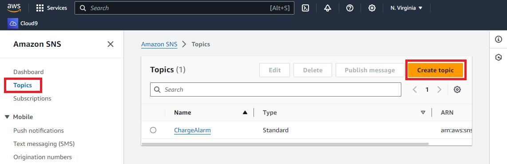
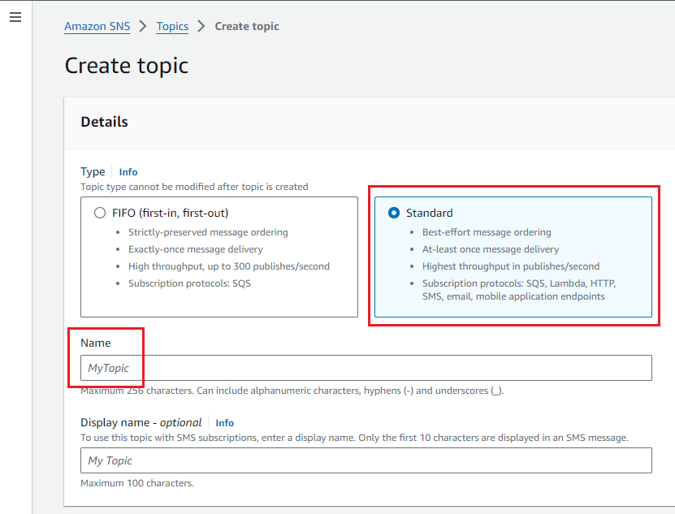
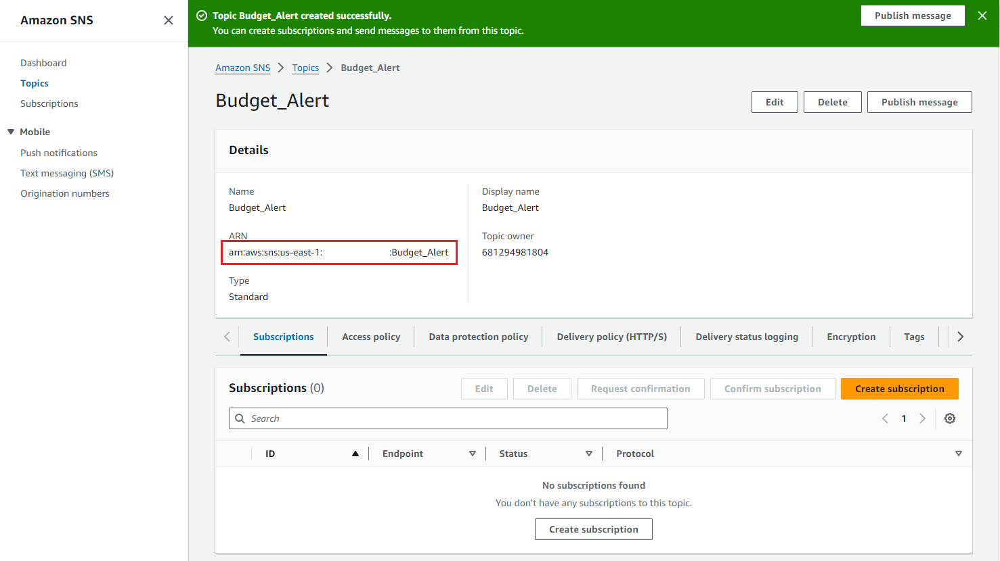
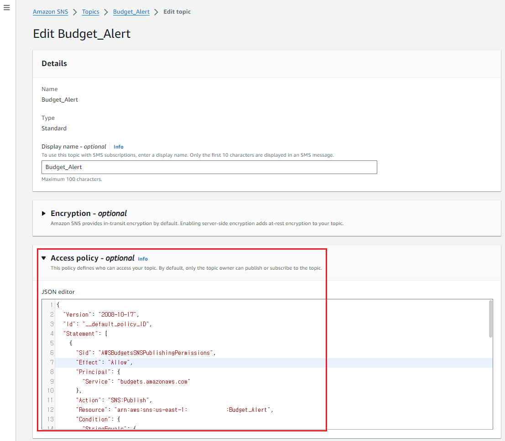
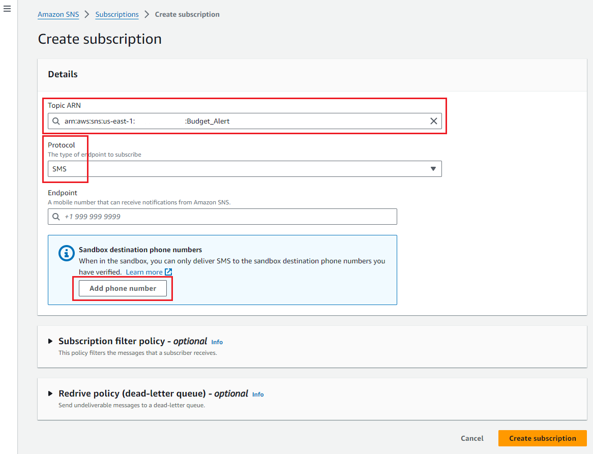
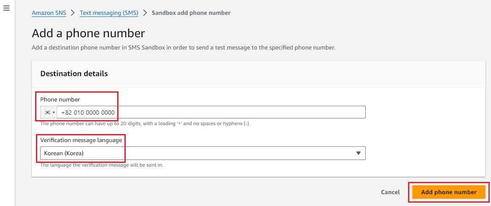
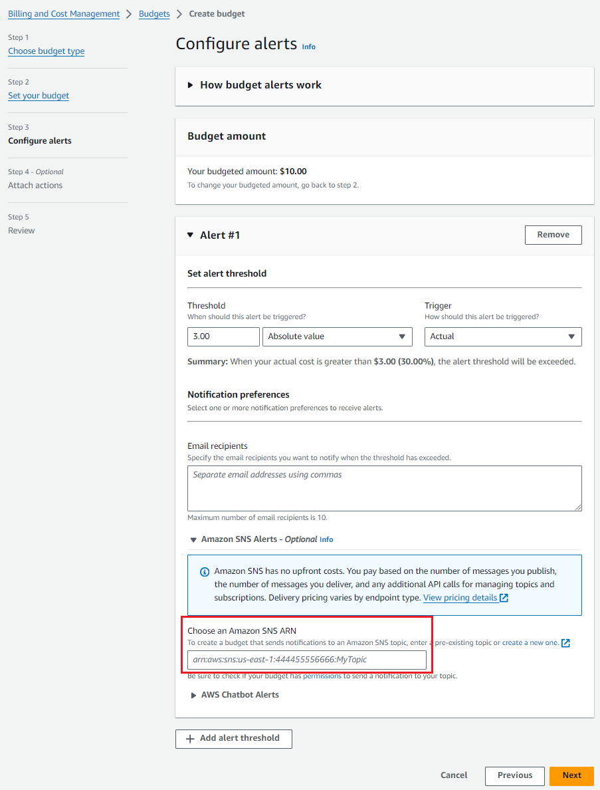

# AWS Budgets를 활용한 요금 SMS 알림
## 예산 알림을 위한 Amazon SNS 주제 생성 
### Budget용 Topic 생성
- Amazon SNS > Topics > Create topic 선택

- Detail 탭에서 아래 정보 입력후, Create topic 선택<br>
Type은 "Standard" 선택<br>
Name과 Display name에 "Budget_Alert" 입력<br>

- Budget_Alert 세부 페이지내 ARN 주소를 메모장에 복사후, Edit 버튼 클릭

- "Access policy - optional" 선택후, JSON editor의 line 5 라인에 아래 코드 추가 후, Save Changes 선택<br>

"your topic ARN"과 "account-id"은 본인정보로 교체
```
{
  "Sid": "AWSBudgetsSNSPublishingPermissions",
  "Effect": "Allow",
  "Principal": {
    "Service": "budgets.amazonaws.com"
  },
  "Action": "SNS:Publish",
  "Resource": "<your topic ARN>",
   "Condition": {
        "StringEquals": {
          "aws:SourceAccount": "<account-id>"
        },
        "ArnLike": {
          "aws:SourceArn": "arn:aws:budgets::<account-id>:*"
        }
      }
}, 
```
- 참고. "Couldn't set topic access policy." 오류 발생시, JSON editor내 policy 재확인

### Topic에 대한 Subscription 생성
- Amazon SNS > Subscriptions > Create Subscription 선택
- Details 탭에서 아래 정보 입력후, Create Subscription 선택<br>
Topic ARN은 위에서 생성한 Topic 선택<br>
Protocol은 SMS 선택<br>
Endpoint에서 Add phone number 선택<br>

- SandBox내 휴대폰 번호 등록
- 본인의 휴대폰 번호 입력. +82 010 0000 0000 형식

- Verification code 6자리 입력후, Verify phone number 클릭
- SNS > Mobile > Text messaging (SMS) > Sandbox destination phone numbers 에서 등록된 휴대폰 번호 확인

### Budget 생성
- Billing and Cost Management > Budgets > Create budget
- Step1. Choose budget type 에서는 "Customize (advanced)" / "Cost budget - Recommended" 선택후 Next 클릭
- Step2. Budget name에 "Budget_SMS_Alerts" 입력,<br> 
Enter your budgeted amount ($)에는 기준 금액 입력(ex. $10)후 선택후 Next 클릭
- Step3. alert threshold 값 입력후, Amazon SNS Alert - Optional 클릭,<br>
위에서 생성한 SNS ARN 입력후 Next 클릭

- Step4. Next 클릭
- Step4. Review 확인후, Create budget 선택
- Alert 조건 충족시, SMS 자동 발송
