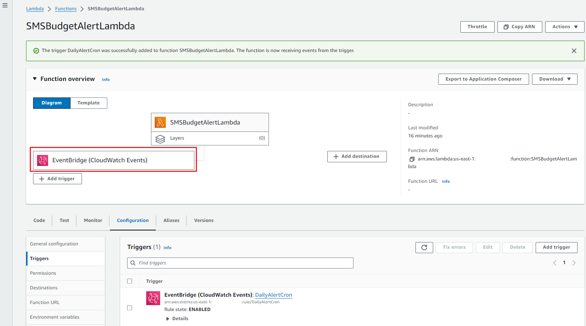

# AWS Lambda와 Amazon SNS를 활용한 요금 일일 SMS 알림

### SMS 발송을 위한 SNS 설정
#### SMS Sandbox에 전화번호 추가

<br>

### Lambda 
#### Function 생성
- AWS Lambda > Dashboard > Create function 선택

- Function name에 `SMSBudgetAlertLambda` 입력<br>
Runtime은 Python 3.12 선택후, Create function 선택


#### 소스코드 업데이트
- Code source 편집기내 lambda_function.py에 아래 코드 업데이트, Deploy 선택

```
import json
import boto3
from datetime import datetime

client = boto3.client('ce', 'us-east-1')

def mtd_cost(start, end):
    response = client.get_cost_and_usage(TimePeriod={'Start':start, 'End':end}, Granularity='MONTHLY', Metrics=['UnblendedCost'])
    amount = response['ResultsByTime'][0]['Total']['UnblendedCost']['Amount']
    amount = round(float(amount), 2) 
    return amount

def lambda_handler(event, context):
    now = datetime.utcnow()
    start = now.strftime('%Y-%m-01')
    end = now.strftime('%Y-%m-%d')

    today_mtd_cost = mtd_cost(start, end)

    message_content = "현재 누적 금액은 $ %s 입니다."%(today_mtd_cost)
    
    sns = boto3.client('sns', region_name='us-east-1')
    sns.publish(PhoneNumber="+82본인휴대폰번호", Message=message_content )

    return {
        'statusCode': 200,
        'body': json.dumps('Ok!')
    }
```


#### 권한 추가
- Configuration > Permissions > Role name 클릭


- IAM 메뉴 전환후, Permissions 탭 > Add Permissions - Create inline policy 선택


- Step1.  Specify permissions에서 <br>
&nbsp;&nbsp;&nbsp; Select a service > SNS 검색후 선택 <br>


&nbsp;&nbsp;&nbsp; Actions allowed에서 Write - Publish 선택 <br>
&nbsp;&nbsp;&nbsp; Resources에서 "All" 선택 <br>


&nbsp;&nbsp;&nbsp; Add more permissions 선택후 <br>
&nbsp;&nbsp;&nbsp; "Cost Explorer Service" 검색 > Access Level Read에서 "GetCostAndUsage" 선택, Next 클릭 <br>
 


- Step2. Review and create에서 Policy name 입력후 Create Policy 선택
- Code source에서 Deploy 클릭 후, Test 클릭 <br>
Event name에 "Run" 입력 후, Save 클릭<br>


&nbsp;&nbsp;&nbsp; 다시 Test 클릭<br>

- 정상 Response 확인


<br>

### EventBridge 추가
- Add trigger 선택


- Trigger configuration 에서 EventBridge (CloudWatch Events) 검색하여 선택<br>
Rule은 Create a new rule 선택<br>
Rule name은 `DailyAlertCron` 입력<br>
Rule Type은 Schedule expression 선택<br>
Schedule expression은 `cron(0 0 * * ? *)` 입력, 매일 오전 9시 실행<br>
Add 선택<br>


- Lambda와 EventBridge 연결 확인



EventBridge > Scheduler > Schedules > Create schedule에서와 동일

<br>

### 리소스 정리(과금 주의)
- 생성한 Lambda function > configuration > Trigger, DailyAlertCron Trigger 삭제 <br>
: SMS 발송 중지를 위한 Trigger 삭제(SMS 발송 건당 $0.02414)
