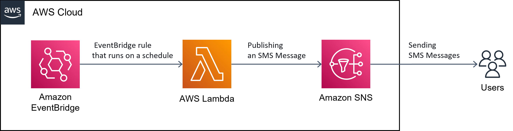

# AWS Lambda와 Amazon SNS를 활용한 SMS 발송

## 목표
* AWS Lambda와 Amazon SNS, Amazon EventBridge를 활용하여, 스케줄링을 통한 SMS 발송하기

## 아키텍처


## 세부 내용
### SNS
> 1. 문자메세지(SMS)에서 샌드박스 대상 전화번호에 본인의 전화번호 추가

### Lambda
> 1. 신규 Lambda 생성
>     * 런타임 - Python 3.7 
> 2. 아래 소스 코드 입력
```
import json
import boto3

def lambda_handler(event, context):

    client = boto3.client(
        "sns",
        # 본인의 Region Code입력. ex) region_name="ap-northeast-2"
    	region_name="xx-xxxx-x"
    )
    
    client.publish(
		# SMS 샌드박스에 등록한 본인 전화번호로 수정
        PhoneNumber="+8210xxxxyyyy",
        Message="Hello World!"
    )

    return {
        'statusCode': 200,
        'body': json.dumps('Ok!')
    }
```
> 3. Lambda 실행 역할에, SNS 관련 권한 추가
> 4. Test Event로 함수를 호출하여, 정상 동작 확인
> 5. 하드코딩된 "PhoneNumber", "Message" 값을 Event JSON 객체로 호출하도록, Test Event 추가 및 소스 변경

### EventBridge
> 1. 아래 규칙에 맞는 신규 규칙(Cron식) 생성
>     * 2022년 7월, 매주 목요일 00:00:00 UTC에 실행
>     * Next 10 trigger date(s)
>         * Thu, 21 Jul 2022 00:00:00 UTC 
>         * Thu, 28 Jul 2022 00:00:00 UTC 
> 2. 생성한 Lambda 연결

## 제출 결과물
> 1. Lambda ARN	
> 2. Lambda 최종 소스("Lambda" 5번 내용 반영된 소스)
> 3. EventBridge Cron식
